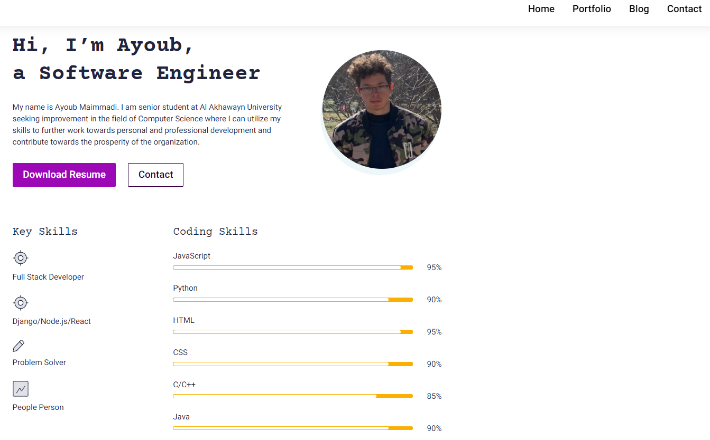

# My Resume Website



## Resume Website created using Django Framework.

## Allows the manager the have full managerial control over his business

### The manager or admin can Add, Delete, manage and Search Orders, Customer, Suppliers, Employees, and Billing.

To use/view this system you need to:

1- Clone or Download this repository

2- Have django pre-installed in you computer

3- Launch your IDE and cd into the project

4- open terminal and cd into the environment: `workon <name>`

##### - `python manage.py runserver` to open development at the environment you created

##### All the commands used to create the project:

```
py -3 -m venv <name>
pip install django Pillow django-ckeditor
mkdir dev
cd dev
virtualenv
py -3 -m venv <name>
python -m virtualenv <name>
.\Scripts\activate
mkvirtualenv
workon <envname>
deactivate
django-admin.py startproject <projectname>
django-admin startproject <projectname>
python manage.py makemigrations
python manage.py migrate
python manage.py createsuperuser
python manage.py runserver
python manage.py startapp <appname>
```
